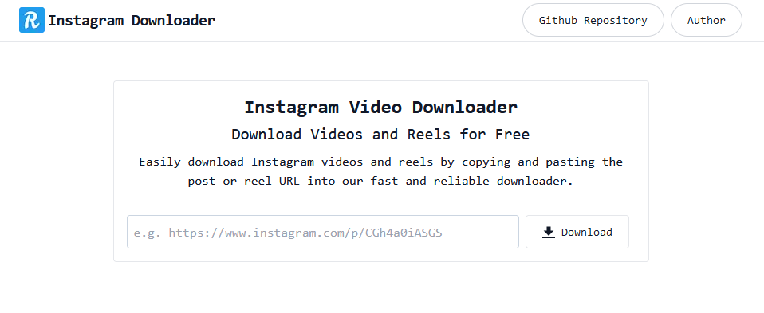
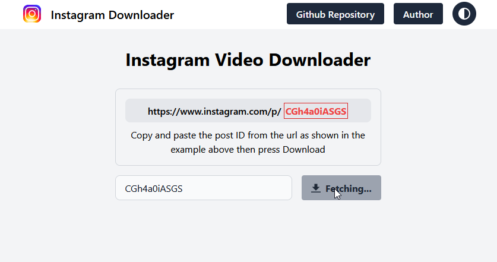
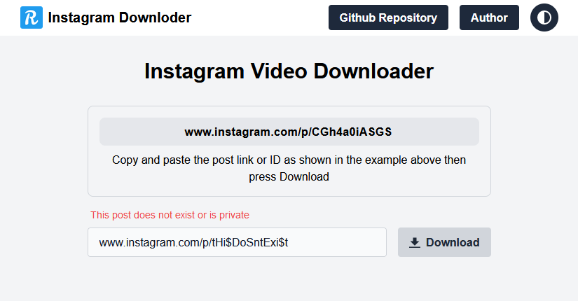

# Instagram Videos Downloader

Simple Website/API for downloading instagram videos

## Description

A website that lets you download Instagram videos easily and quickly. You can paste the link or ID of any public Instagram post and get the video file in MP4 format. there is also an API that you can use to integrate this functionality into your own applications. The API is simple, and it returns JSON responses with the video URL and other metadata.

**You can preview and try the website live in my replit here : [Instagram Videos Downloader](https://insta-vids-downloder.riadazzoun.repl.co)**

## Getting Started

### Website Preview







## Installation & Running

- Cloning the repository

```bash
git clone https://github.com/riad-azz/insta-videos-downloder.git
```

- Installing dependencies

```bash
cd insta-videos-downloder
```

```bash
# Install packages
npm install

# pm2 installation is optional but recommanded for production
npm install -g pm2
```

- Running the build command

```bash
npm run build
```

- Starting the server

```bash
# Developement (requires build)
npm start

# Watch mode (Doesn't require to run the build command)
npm run dev

# Production (requires build and 'pm2' to be installed)
npm run prod
```

- Utils

```bash
# Tailwind css watch ./views
npm run css
```

## API Documentation

The API is pretty simple and straightforward.

There is one endpoint `/api` that takes the post link or ID as a param `id` _(required)_.

### Video request

`GET /api?id={POST_ID}`

```bash
# Post ID
curl -i "http://localhost:3000/api?id=CGh4a0iASGS"

# Post link
curl -i "http://localhost:3000/api?id=www.instagram.com/p/CGh4a0iASGS"
```

```bash
# JSON Response
{
    "id": "CGh4a0iASGS",
    "username": "riad-azz",
    "videos":[
        {
        "caption": "post caption",
        "description": "24 Likes, 10 Comments - extra description info",
        "resolution": "1920x1080",
        "uploadDate": "2023-01-24T08:01:47-07:00"
        "thumbnail": "THUMBNAIL_URL",
        "url": "MP4_FILE_URL"
        }
    ]
}
```

## License

This project is licensed under the [MIT] License - see the LICENSE.md file for details
